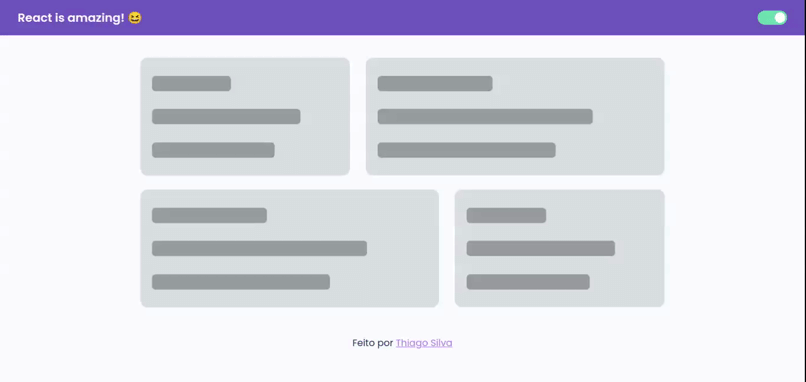

### :pushpin: Sobre o projeto:

Projeto simples de ThemeSwitch feito com ReactJS e animações feitas com o FramerMotion.



Você pode acessar o projeto por este [link](https://theme-switch-react-js.vercel.app/).

### :wrench: Tecnologias usadas:
- [ReactJS](https://reactjs.org/)
- [Styled-Components](https://styled-components.com/)
- [FramerMotion](https://www.framer.com/motion/)

### :building_construction: Como rodar na sua máquina?

Clone este repositório:
``` bash
git clone https://github.com/th1ag0-Zz/ThemeSwitch-ReactJS.git
```
Depois navegue até a pasta e abra no seu VsCode (ou seu editor de preferência)
``` bash
cd ThemeSwitch-ReactJS

code .
```
Rode o comando ```yarn  start``` para inicar o projeto no seu navgador.
<br />
<br />
Pronto! Agora você pode fazer suas modificações. 😃
